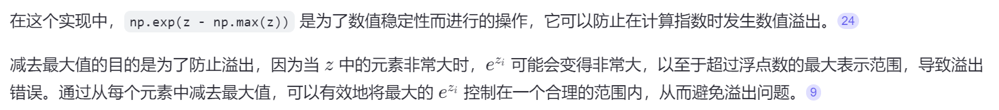

# Numpy 实现Softmax
## 1. 原理


## 2. 实现
```python
import numpy as np

def softmax(z):
    # 减去最大值提高数值稳定性
    exp_z = np.exp(z - np.max(z))
    return exp_z / exp_z.sum(axis=0, keepdims=True)

# 示例
z = np.array([1.0, 2.0, 3.0])
print("Softmax output:", softmax(z))
```


```python
def softmax_2d(X):
    # 沿行计算最大值并保持维度
    max_X = np.max(X, axis=1, keepdims=True)
    # 计算每行的最大值
    exp_X = np.exp(X - max_X)
    # 计算每行的和并保持维度
    sum_exp_X = np.sum(exp_X, axis=1, keepdims=True)
    # 归一化
    return exp_X / sum_exp_X

# 示例
X = np.random.randn(3, 4)  # 创建一个3x4的随机数组
print("Softmax output for 2D array:", softmax_2d(X))
```